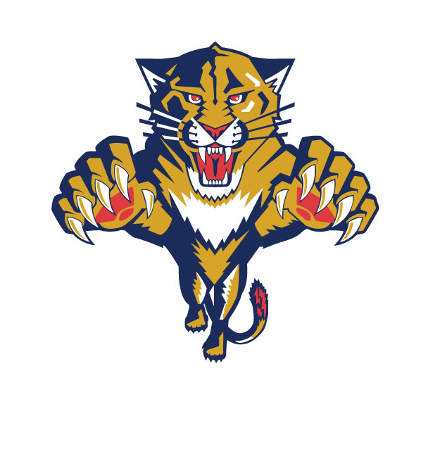

#Team Panther
######Unity Projects - CG Fall 2015 @ Rutgers
######By: *[Purvil Patel], [Parth Shah], [Rajan Patel], [Harshil patel]*
Check out our website: [Team Panther Blog](https://infopurvil.wordpress.com/teampanther/ "Team Panther page")

###B1: Navigation and Animation
The assignment consists of three parts. There are three Scenes containing each part of an assignment. Scene consists of a music file, water-body, a light-post to make it more creative and appealing.
1) Navigation
2) Animation
3) Navigation and Animation
Demo: [Demo of the project](http://eden.rutgers.edu/~pas312/B1/all/Desktop.html "Play!")

###B2: Inverse Kinematics and Behavior Tree

Characters – Street fighters, Soldier

User Input – Keyboard(Arrow Keys, Shift, E for door open)

Object Interaction – Door

Story is situated in a complex environment where we have a ground with a warehouse and door in it.

Initially Street fighters are approaching each other and then they look at each other and after that some dispute happens between them so they start fighting with each other. We have one surveillance camera (top right corner) to view the streets. As we see fights on street, we can move our soldier in that direction (User Interaction). As the fighters get to know about the soldier approaching them, they start running away from each other.

While wandering in the streets for fighters, our soldier come across the warehouse. Where he can open the door to look into for the fighters. (Object Interaction).
User Interaction – Our soldier can run fast to accelerate the search by pressing shift key while wandering.
Object Interaction – Our soldier can interact with the door and open the door by pressing E key.

We used inverse kinematics for two different actions namely

Look-at Action
Random Fight Action
Scalable to Agents – Our street fighters and soldier is prefab and all the street fighters uses common scripts. So, It is quite scalable if we plan to add more fighters or soldiers. We have 7 characters: 6 Street fighters and 1 Soldier.

Non Linear characteristic – Our fighters chooses different fight moves randomly.

###B3: Interactive Narrative Game
Part 1:

We have shown the behavior tree in above figures for the story of our interactive narrative.

In part 1, Multiple street fighters are fighting each other in an environment and there is a soldier inside warehouse.

Soldier comes out of the warehouse by opening the door. We have used inverse kinematics for implementing this.

As soon as the fighters see the soldier, they start running for their lives and soldier starts following any one of the fighters randomly. (non-linearity)

Fighters chooses fighting moves randomly from Kick or Punch and they try to dodge when other fighter tries to hit them.

Part 2:

In this Part we have given user the control of soldier.
User can control soldier through Keyboard. 

Walk: Arrow Keys
Jump: Space
Shift: Run

The story remains the same as Part 1 and has similar flow of behavior tree.

-	How, user can impact on flow of story?

User can choose when to enter the field by opening the door. So, Fighters will start running only when user opens the door and is visible to fighters.

Part 3:

In this part, user can choose to be either a fighter or a soldier.
Story works perfectly for both fighter and soldier.

User can control soldier and fighter through keyboard.

Soldier control

Walk: Arrow Keys
Jump: Space
Shift: Run	Fighter Control

Fighter Control

Run and Turn: Arrow Keys
Shift: Fight

